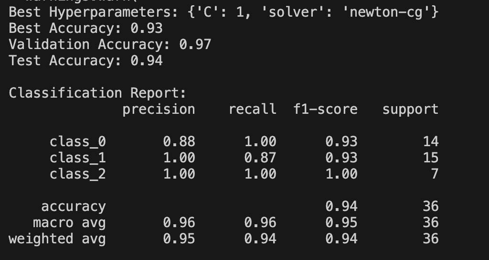

### README 

#### Project Overview
This repository applies machine learning classifiers on the Wine Dataset, a collection of chemical analysis results from wines grown in the same region in Italy but derived from three different cultivars.The dataset encompasses 13 distinct chemical attributes, such as Alcohol, Malic Acid, Ash and so on, which serve as input features. The goal is to accurately classify these wines into their respective cultivars, which are represented by three classes (0, 1, and 2), based on their chemical properties. For this purpose, three different approaches are utilized: K-Nearest Neighbors (KNN), Support Vector Machine (SVM), and Softmax, while using a random prediction model as the baseline model.

#### Getting Started
##### For macOS Users
1. **Install virtualenv:** `python3 -m pip install --user virtualenv`
2. **Create a virtual environment:** `virtualenv env`
3. **Activate the virtual environment:** `source ./env/bin/activate`  
4. **Install required dependencies:**`pip install -r requirements.txt`
5. **Run the main script:** `python runner.py` 

##### For Windows Users
1. **Install virtualenv:** `py -m pip install --user virtualenv`
2. **Create a virtual environment:** `virtualenv env`
3. **Activate the virtual environment:** `.\env\Scripts\activate`
4. same as above
5. same as above

#### Results
To replicate the results, simply follow the "Getting Started" instructions. The script `runner.py` will call each files, which train the models on the Wine Dataset and output the classification report, including accuracy, precision, recall, and F1-score. Following is the screenshots for the result:

